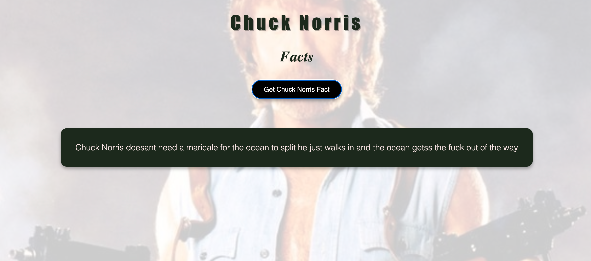

# Chuck Norris Facts (Sort of) 

## Description
The purpose of this application is to generate stone cold facts about the one and only Texas Ranger - Chuck Norris. Simply click the button for a new fact about the man, the myth, the legend.

## Table of Contents
- [Description](#description)
- [Installation](#installation)
- [Usage](#usage)
- [License](#license)
- [Screenshots](#screenshots)
- [Links](#links)
- [Resources / Credits](#credits)

## Installation
* No installation necessary.

## Usage
* Follow the link to the deployed site below.

## License
Permission is hereby granted, free of charge, to any person obtaining a copy of this software and associated documentation files (the "Software"), to deal in the Software without restriction, including without limitation the rights to use, copy, modify, merge, publish, distribute, sublicense, and/or sell copies of the Software, and to permit persons to whom the Software is furnished to do so, subject to the following conditions:

The above copyright notice and this permission notice shall be included in all copies or substantial portions of the Software.

THE SOFTWARE IS PROVIDED "AS IS", WITHOUT WARRANTY OF ANY KIND, EXPRESS OR IMPLIED, INCLUDING BUT NOT LIMITED TO THE WARRANTIES OF MERCHANTABILITY, FITNESS FOR A PARTICULAR PURPOSE AND NONINFRINGEMENT. IN NO EVENT SHALL THE AUTHORS OR COPYRIGHT HOLDERS BE LIABLE FOR ANY CLAIM, DAMAGES OR OTHER LIABILITY, WHETHER IN AN ACTION OF CONTRACT, TORT OR OTHERWISE, ARISING FROM, OUT OF OR IN CONNECTION WITH THE SOFTWARE OR THE USE OR OTHER DEALINGS IN THE SOFTWARE.

## Screenshot
 

## Links

* Deployed Link at GH Pages: https://jonteal.github.io/chucknorris/
* Github Repository: https://github.com/jonteal/chucknorris

## Resources / Credits
I used the Chuck Norris Facts API and also some CSS Button Style from Prio-Soft.

* Chuck Norris Facts API: https://api.chucknorris.io/
* Prio-Soft: https://codepen.io/priosoft